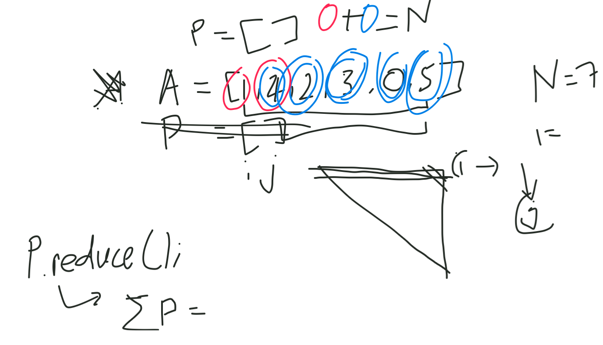

We're trying to break pairwise from the freecodecamp





First you have to create a function to save the logic of the code.

> #### The code will contain logic as below.
>
> - Check every pair
> - Exclude pairs that contain previously paired elements
> - Sum the result

```js
function pairwise(arr, arg) {
  let pairIndices = [];
  // Check every pair
  for (let i = 0; i < arr.length; i++) {
    for (let j = i + 1; j < arr.length; j++) {

      // Exclude pairs that contain previously paired elements
      if (arr[i] + arr[j] == arg
          && !pairIndices.includes(i)
          && !pairIndices.includes(j)) {
          pairIndices.push(i, j);
        break;
      }
    }
  }

  let result = pairIndices.reduce((sum, curr, index) => sum + curr, 0);

  return result;
}
```

then we executes the pairwise function.

```js
pairwise([1,4,2,3,0,5], 7);
```